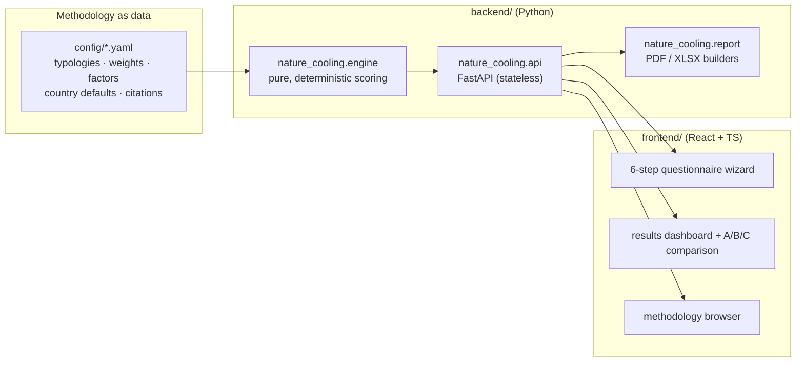

# System Architecture

Architecture of the Nature for Cooling Rapid Assessment Tool. Companion to [methodology/](methodology/README.md), which explains what the numbers mean.

## 1. Overview



Three hard boundaries:

1. **Config → Engine.** All methodology values (typology performance, weights, factors, defaults, citations) are YAML under `config/`, schema-validated at load. Changing the methodology never requires changing code.
2. **Engine → API.** The engine is a pure function `run_assessment(AssessmentInput, MethodologyConfig) → AssessmentResult` — no I/O, no network, no randomness, no global state. The API is a thin stateless wrapper.
3. **API → Frontend.** The frontend owns UX only. It never computes scores; even previews come from the API. One source of truth for every number.

## 2. Backend

### 2.1 Package layout

```
backend/
├── pyproject.toml                  # distribution: criterra-nature-cooling
├── src/nature_cooling/
│   ├── __init__.py                 # __version__ (engine semver)
│   ├── engine/
│   │   ├── models.py               # Pydantic v2: AssessmentInput / AssessmentResult
│   │   ├── config.py               # YAML loader + schema validation + version stamp
│   │   ├── scoring/                # one module per formula family
│   │   │   ├── heat_exposure.py    #   heat exposure (data-rich / data-poor paths)
│   │   │   ├── vulnerability.py
│   │   │   ├── heat_priority.py
│   │   │   ├── suitability.py      #   suitability score + hard suitability flags
│   │   │   ├── adjustment.py       #   derived site factors
│   │   │   ├── cooling.py          #   score + °C range clipped to envelope
│   │   │   ├── energy_ghg.py
│   │   │   ├── costs.py            #   capex, savings, payback, derived feasibility
│   │   │   ├── co_benefits.py
│   │   │   ├── equity.py
│   │   │   └── final_score.py
│   │   ├── confidence.py           # branched per-block confidence
│   │   ├── recommendation.py       # deterministic template composer
│   │   └── runner.py               # orchestration: run_assessment()
│   ├── cli.py                      # `nature-cooling serve` console script
│   ├── api/
│   │   ├── main.py                 # FastAPI app factory
│   │   ├── schemas.py              # API-layer models + storage document schema
│   │   ├── storage.py              # local-first project store (platformdirs, atomic JSON)
│   │   ├── validation.py           # /validate: errors, warnings, confidence preview + hint
│   │   ├── webapp.py               # embedded frontend at `/`, SPA fallback
│   │   └── routes/                 # assessments, methodology, meta, projects, reports
│   └── report/
│       ├── catalog.py              # module-level English string catalog
│       ├── content.py              # stored assessments → display rows, verbatim (single + comparison)
│       ├── pdf.py                  # 2-page PDF + comparison PDF, brand TTFs embedded
│       ├── xlsx.py                 # workbooks: per-assessment and comparison
│       └── fonts/                  # static TTF builds + OFL notices
└── tests/
    ├── scoring/                    # unit tests per module (100% engine coverage target)
    ├── scenarios/                  # golden cases: input JSON → hand-verified expected output
    ├── api/                        # contract tests per endpoint (100% api coverage target)
    └── report/                     # extracted-text/structure + byte-determinism tests
```

### 2.2 Engine contract

- **Deterministic:** same `AssessmentInput` + same config version → byte-identical `AssessmentResult`.
- **Versioned:** every result records `engine_version` (semver) and `methodology_version` (date-stamped config version). Comparisons across differing methodology versions warn.
- **Missing data:** required fields fail validation before scoring; optional fields fall back (qualitative → `unknown` = 50; quantitative → `None` propagates to `not_applicable`, never a silent zero). Every applied default is itemised in `assumptions_applied`.
- **Suitability gates:** disqualifying site conditions produce `suitability_flags` in the result; the UI and report must render them prominently.

### 2.3 API surface (v1)

| Endpoint | Purpose |
|---|---|
| `POST /api/assessments/evaluate` | Validate input, run engine, return full result (stateless) |
| `POST /api/assessments/validate` | Dry-run validation for inline form feedback: errors + warnings, per-block confidence preview, highest-value missing field hint |
| `GET  /api/typologies` | Typology library incl. suitability conditions and citations |
| `GET  /api/methodology` | Formulas, weights, factors, version — powers the methodology browser |
| `GET  /api/meta` | Engine version, methodology version, license |
| `GET  /api/projects` | Project summaries, most recently updated first |
| `POST /api/projects` | Create a project (name + site description) |
| `GET  /api/projects/{id}` | Full project incl. assessments and `methodology_update_available` flags |
| `PATCH /api/projects/{id}` | Update name / site description |
| `DELETE /api/projects/{id}` | Delete a project |
| `POST /api/projects/{id}/assessments` | Create a draft assessment (auto-save target) |
| `GET  /api/projects/{id}/assessments/{aid}` | One stored assessment |
| `PATCH /api/projects/{id}/assessments/{aid}` | Update label / draft input (input frozen once evaluated) |
| `DELETE /api/projects/{id}/assessments/{aid}` | Delete an assessment |
| `POST /api/projects/{id}/assessments/{aid}/evaluate` | Explicitly run the engine and persist the result; refuses to recompute a stored result |
| `POST /api/projects/{id}/assessments/{aid}/duplicate` | Comparison draft: carries the site description, blanks intervention + cost/energy groups |
| `GET  /api/projects/{id}/assessments/{aid}/report.pdf` | The 2-page PDF report of a **stored** result; 404 unknown ids, 409 for a draft |
| `GET  /api/projects/{id}/assessments/{aid}/report.xlsx` | The XLSX workbook (Inputs, Results, Assumptions & Warnings) of a stored result; same refusals |
| `GET  /api/projects/{id}/report/comparison.pdf` | Comparison report over 2–4 stored, evaluated assessments (`?assessments=` ids, caller's order = column order); 409 if any is a draft |
| `GET  /api/projects/{id}/report/comparison.xlsx` | The comparison workbook (Comparison, Site context, Scenario detail); same refusals |

Persistence in v1 is **local-first**: one JSON document per project (`schema_version`, identity, timestamps, site description, `assessments[]` each holding its full input and full versioned result) under the `platformdirs` user-data directory, owned by a thin storage layer behind the API; multi-user storage is v2. Stored results are never recomputed — a newer methodology version is surfaced as available, and re-running is an explicit user action creating a new assessment.

## 3. Frontend

React + TypeScript (Vite). Structure mirrors the user journey:

- **Questionnaire wizard** — the 6 input groups as steps (project → site → climate → vulnerability → intervention → cost/energy); inline validation via `/validate`; every field with the qualitative fallback and "unknown" affordances the methodology requires.
- **Results dashboard** — score cards (Heat Priority Index, NbS Cooling Opportunity Score), the six output blocks, branched confidence badges, suitability flags, assumptions list, recommendation.
- **Comparison view** — same site, interventions A/B/C side by side, with user-editable scenario labels and a PDF/XLSX comparison export (2–4 options, in the on-screen order). Options assessed at different scales are flagged as not like for like — on screen and in the export — rather than silently tabulated; the export highlights the best value per criterion and states the facts in a short narrative, but never ranks the options or names a winner.
- **Methodology browser** — renders `/api/methodology` + citations; every score in the UI links to its formula and sources.

Visual identity: the criterra.eu design tokens (paper `#eaebe2`, ink `#16231c`, brand green `#2e6a4e`; Newsreader / Hanken Grotesk / IBM Plex Mono, self-hosted). Design north star: *"a scientific instrument, not a lifestyle app"* — whitespace, one accent colour, score cards, no rainbow dashboards. WCAG AA.

## 4. Configuration (`config/`)

| File | Content |
|---|---|
| `nbs_typologies.yaml` | 18 cooling archetypes and the 110 typologies inheriting them: an archetype carries every performance value and suitability condition, and **every archetype carries a `sources:` array (DOI + finding)**; a typology carries identity, family and availability, and no performance value of its own |
| `availability.yaml` | Which entries are offered for a given scale, land use and site conditions — gating is configuration, never code, and feeds no score |
| `weights.yaml` | All aggregation weights (single global set) |
| `adjustment_factors.yaml` | Condition → factor tables + derivation rules |
| `input_mapping.yaml` | Qualitative → numeric mappings |
| `country_defaults.yaml` | Emission factors, energy prices, currency (each cited: IEA/Ember, national sources) |
| `recommendation_templates.yaml` | Deterministic recommendation fragments |
| `climate_classification.yaml` | Köppen–Geiger class → climate zone, for the map picker's autofill. A methodology value, not data: the classification is cited to `beck2023`, the mapping onto the tool's six zones is the methodology's own judgement |
| `derived_scores.yaml` | Derived sub-indicators, confidence blocks and thresholds |

Each file has a top-level `version:` (date-stamped), and all of them must agree — a mismatch fails config load and CI. CI validates schemas and refuses uncited performance values.

### 4.1 Bundled datasets (`data/geo/`)

Three published geographic datasets ship inside the wheel, staged alongside `config/` and the bibliography, so that the map-based site picker and its place search work with **no network access at all**: Natural Earth admin-0 boundaries (public domain, at 1:50m for the country lookup and 1:110m for the basemap the browser draws), Natural Earth populated places (public domain, all 7,342 — the offline place-search index), and the Köppen–Geiger present-day classification at 0.1° (Beck et al. 2023, CC BY 4.0). All are derived from their published sources by `tools/build_datasets.py`, which records each source checksum; all ship with their full licence text and a statement of what was changed, in `data/geo/`. The runtime formats are JSON and zlib, so the package needs no geospatial dependency and installs with one command.

## 5. Quality and CI/CD

- **Tooling:** `ruff` (lint + format), `mypy --strict` on the engine, `pytest` + coverage; frontend: `eslint`, `tsc`, `vitest`.
- **Tests:** unit tests per scoring module; ~20 golden scenarios with hand-verified outputs as regression armor; config schema tests; API contract tests; determinism test (repeat runs byte-identical).
- **CI (GitHub Actions):** every push/PR → lint, type-check, tests, coverage gate, plus the packaged-wheel smoke check (build frontend + wheel together, install, assert `/` serves the app shell and `/api/meta` answers), a container-image build, and a strict documentation-site build; pushes to `main` redeploy the docs site to GitHub Pages. Methodology version changes require a matching Methodology Report update (checked in review).
- **Releases:** a `vX.Y.Z` tag runs the full gates, then builds the wheel, pushes the container image to GHCR, redeploys the docs site, and creates a GitHub release with the wheel attached.
- **Conventional Commits**; one coherent change set per merge to `main`.

## 6. Deployment model

- **v1 local-first:** the wheel embeds the production frontend build and the cited methodology configuration; `pip install "criterra-nature-cooling[serve]"` + `nature-cooling serve` starts API and web app on one origin (no CORS middleware). Projects live under the `platformdirs` user-data path.
- **Hosting:** one container image built from the wheel (python-slim, non-root) with a minimal `compose.yaml` mounting a named volume at the data path; reverse proxy, TLS, and multi-user machinery remain the host's concern and v2's scope.
- **Runtime configuration (v2.2):** exactly one setting exists — the map-imagery tile source, `NATURE_COOLING_TILE_URL` + `NATURE_COOLING_TILE_ATTRIBUTION` (or the equivalent `nature-cooling serve --tile-url/--tile-attribution` flags). Unset, the application makes no third-party request of any kind; a deployment operator who sets both gives that deployment's browsers real imagery, requested browser-direct and credited on the map. [HOSTING.md](HOSTING.md) is the operator's page.
