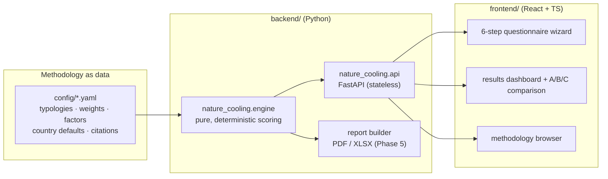

# System Architecture

Architecture of the Nature for Cooling Rapid Assessment Tool. Companion to [DECISIONS.md](DECISIONS.md) (why) and [methodology/](methodology/) (what the numbers mean). This document describes v1; deferred capabilities live in [V2-VISION.md](V2-VISION.md).

## 1. Overview



Three hard boundaries:

1. **Config → Engine.** All methodology values (typology performance, weights, factors, defaults, citations) are YAML under `config/`, schema-validated at load. Changing the methodology never requires changing code.
2. **Engine → API.** The engine is a pure function `run_assessment(AssessmentInput, MethodologyConfig) → AssessmentResult` — no I/O, no network, no randomness, no global state. The API is a thin stateless wrapper.
3. **API → Frontend.** The frontend owns UX only. It never computes scores; even previews come from the API. One source of truth for every number.

## 2. Backend

### 2.1 Package layout

```
backend/
├── pyproject.toml                  # distribution: criterra-nature-cooling
├── src/nature_cooling/
│   ├── __init__.py                 # __version__ (engine semver)
│   ├── engine/
│   │   ├── models.py               # Pydantic v2: AssessmentInput / AssessmentResult
│   │   ├── config.py               # YAML loader + schema validation + version stamp
│   │   ├── scoring/                # one module per formula family
│   │   │   ├── heat_exposure.py    #   heat exposure (data-rich / data-poor paths)
│   │   │   ├── vulnerability.py
│   │   │   ├── heat_priority.py
│   │   │   ├── suitability.py      #   suitability score + hard suitability flags (D-009)
│   │   │   ├── adjustment.py       #   derived site factors (OQ-16/17 rules)
│   │   │   ├── cooling.py          #   score + °C range clipped to envelope (D-008)
│   │   │   ├── energy_ghg.py
│   │   │   ├── costs.py            #   capex, savings, payback, derived feasibility (D-010)
│   │   │   ├── co_benefits.py
│   │   │   ├── equity.py
│   │   │   └── final_score.py
│   │   ├── confidence.py           # branched per-block confidence (OQ-09)
│   │   ├── recommendation.py       # deterministic template composer
│   │   └── runner.py               # orchestration: run_assessment()
│   └── api/
│       ├── main.py                 # FastAPI app factory
│       └── routes/                 # assessments, methodology, meta
└── tests/
    ├── scoring/                    # unit tests per module (100% engine coverage target)
    ├── scenarios/                  # golden cases: input JSON → hand-verified expected output
    └── api/
```

### 2.2 Engine contract

- **Deterministic:** same `AssessmentInput` + same config version → byte-identical `AssessmentResult`.
- **Versioned:** every result records `engine_version` (semver) and `methodology_version` (date-stamped config version). Comparisons across differing methodology versions warn.
- **Missing data:** required fields fail validation before scoring; optional fields fall back (qualitative → `unknown` = 50; quantitative → `None` propagates to `not_applicable`, never a silent zero). Every applied default is itemised in `assumptions_applied`.
- **Suitability gates:** disqualifying site conditions produce `suitability_flags` in the result; the UI and report must render them prominently (D-009).

### 2.3 API surface (v1)

| Endpoint | Purpose |
|---|---|
| `POST /api/assessments/evaluate` | Validate input, run engine, return full result (stateless) |
| `POST /api/assessments/validate` | Dry-run validation for inline form feedback (errors + warnings) |
| `GET  /api/typologies` | Typology library incl. suitability conditions and citations |
| `GET  /api/methodology` | Formulas, weights, factors, version — powers the methodology browser |
| `GET  /api/meta` | Engine version, methodology version, license |
| `POST /api/reports/pdf` (Phase 5) | Render a result to the 2-page PDF |

Persistence in v1 is **local-first**: projects/assessments as JSON on disk (per the original spec §13), owned by a thin storage layer behind the API; multi-user storage is v2.

## 3. Frontend

React + TypeScript (Vite). Structure mirrors the user journey:

- **Questionnaire wizard** — the 6 input groups as steps (project → site → climate → vulnerability → intervention → cost/energy); inline validation via `/validate`; every field with the qualitative fallback and "unknown" affordances the methodology requires.
- **Results dashboard** — score cards (Heat Priority Index, NbS Cooling Opportunity Score), the six output blocks, branched confidence badges, suitability flags, assumptions list, recommendation.
- **Comparison view** — same site, interventions A/B/C side by side (D-005).
- **Methodology browser** — renders `/api/methodology` + citations; every score in the UI links to its formula and sources.

Visual identity: the criterra.eu design tokens (paper `#eaebe2`, ink `#16231c`, brand green `#2e6a4e`; Newsreader / Hanken Grotesk / IBM Plex Mono, self-hosted). Design north star: *"a scientific instrument, not a lifestyle app"* — whitespace, one accent colour, score cards, no rainbow dashboards. WCAG AA.

## 4. Configuration (`config/`)

| File | Content |
|---|---|
| `nbs_typologies.yaml` | 14 typologies: performance values, suitability conditions, cost defaults — **every value carries a `sources:` array (DOI + finding)** |
| `weights.yaml` | All aggregation weights (single global set, D-011/OQ-29) |
| `adjustment_factors.yaml` | Condition → factor tables + derivation rules |
| `input_mapping.yaml` | Qualitative → numeric mappings |
| `country_defaults.yaml` | Emission factors, energy prices, currency (each cited: IEA/Ember, national sources) |
| `recommendation_templates.yaml` | Deterministic recommendation fragments |

Each file has a top-level `version:` (date-stamped). CI validates schemas and refuses uncited performance values.

## 5. Quality and CI/CD

- **Tooling:** `ruff` (lint + format), `mypy --strict` on the engine, `pytest` + coverage; frontend: `eslint`, `tsc`, `vitest` (from Phase 4).
- **Tests:** unit tests per scoring module; ~20 golden scenarios with hand-verified outputs as regression armor; config schema tests; API contract tests; determinism test (repeat runs byte-identical).
- **CI (GitHub Actions):** every push/PR → lint, type-check, tests, coverage gate. Releases tagged `vX.Y.Z`; methodology version changes require a matching Methodology Report update (checked in review).
- **Conventional Commits**; one development phase per PR/merge to `main`.

## 6. Deployment model

- **v1 local-first:** one command starts API + frontend on the developer/user machine.
- **Later hosting:** the same containers deploy to a small VPS or PaaS; the engine's statelessness makes this a packaging exercise, not a rewrite.
